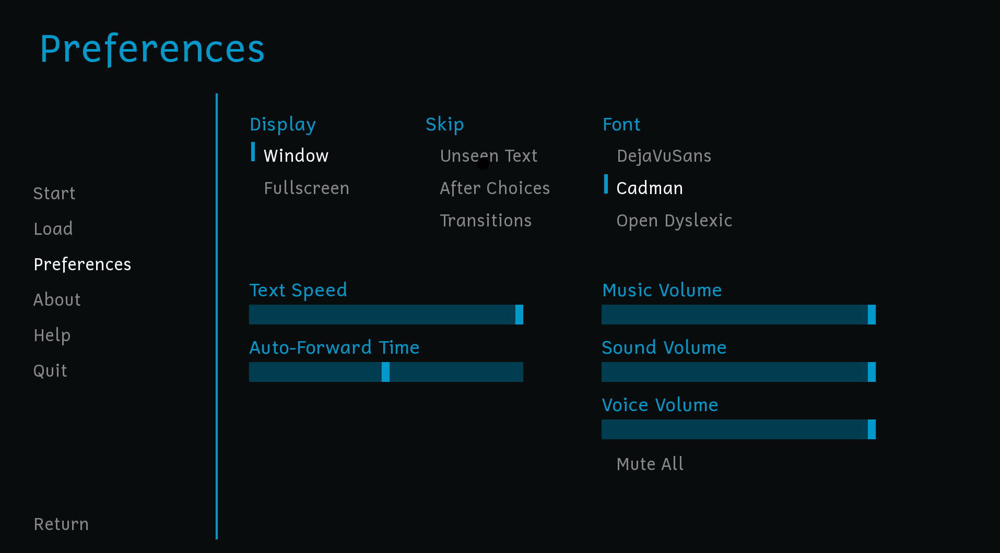
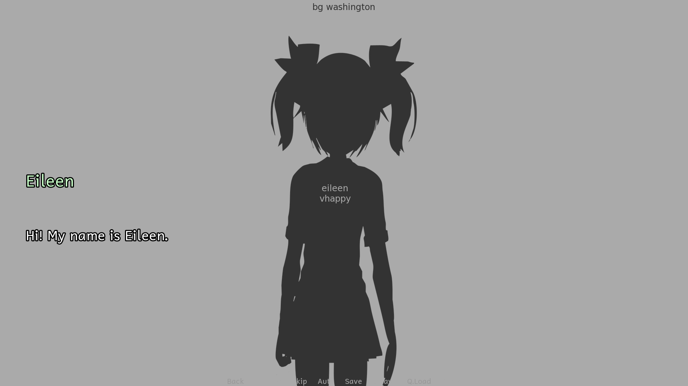
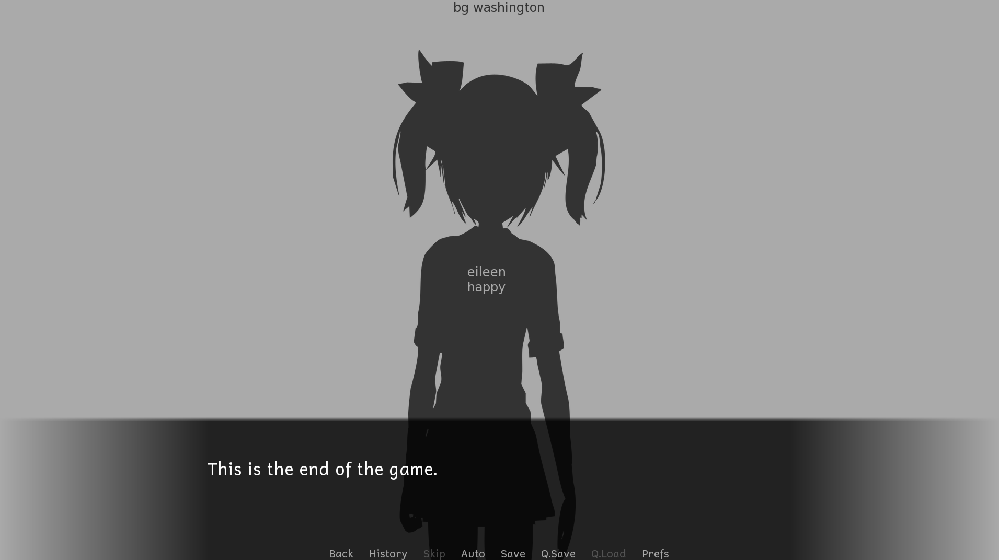
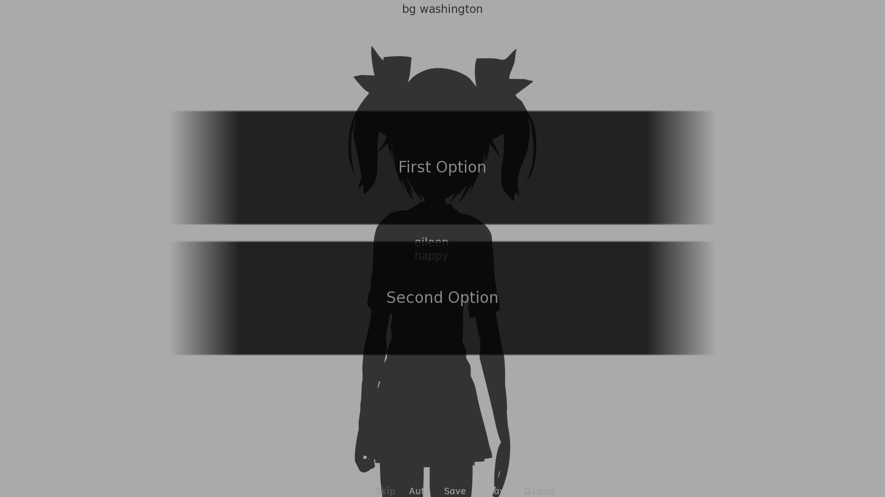

# Ren'Py Template


A customizable **Ren'Py template repository** that you can copy and use as a starting point for your own visual novel projects.

This template includes several UI modifications compared to the default Ren'Py project, including customizable fonts, a redesigned dialogue layout, and larger choice buttons.

> **Note:** This project is still under development. Some elements of the interface may change or require further adjustments.

---

## Table of Contents

* [Features](#features)
  * [Font Selection](#font-selection)
  * [Dialogue Display](#dialogue-display)
  * [Choice Buttons](#choice-buttons)
* [Changes from Standard Ren'Py](#changes-from-standard-renpy)
* [Installation](#installation)
* [Customization](#customization)
* [Screenshots](#screenshots)
* [Ren'Py Version](#renpy-version)
* [License](#license)

---

## Features

### Font Selection

The **Settings** menu includes an option to change the font used by the game.

Currently, **three fonts** are included, but you can easily replace them or add your own.

The relevant settings can be found in: `game/screens.rpy`

The main sections to edit are:

* **Lines 780–814** → font references
* **Lines 942–952** → fonts displayed as selectable options in the Settings menu

To add your own fonts, simply place the font files in the appropriate project folder and update the references in `screens.rpy`.

---

### Dialogue Display

The dialogue interface has been redesigned compared to the standard Ren'Py layout.

* The dialogue is displayed in the **upper-left area of the screen**.
* The dialogue has **no background box**.
* The character's name and dialogue are displayed directly on the screen.

When defining a character in script.rpy, make sure to add:
```
screen="character_say"
```
This tells Ren'Py to use the custom character dialogue box instead of the standard dialogue screen. When it is not specified, the **classic Ren'Py dialogue layout** is being used.

---

### Choice Buttons

The buttons used to display dialogue choices are **significantly larger** than the standard Ren'Py buttons.

Inside `screens.rpy`, you can find:

```renpy
style choice_button is default:
    properties gui.button_properties("choice_button")
    ysize 250
```

* `ysize` controls the **height of the choice buttons**.

To restore the default Ren'Py settings, simply remove the `ysize` line.

---

## Changes from Standard Ren'Py

| Feature               | Standard Ren'Py       | This Template                  |
| --------------------- | --------------------- | ------------------------------ |
| Font selection        | Limited/default       | Multiple selectable fonts      |
| Character dialogue    | Classic Ren'Py layout | Upper-left, transparent layout |
| Narration             | Classic Ren'Py layout | Classic Ren'Py layout          |
| Choice buttons        | Standard size         | Larger buttons                 |
| Choice text alignment | Standard              | Still being adjusted           |

---

## Installation

### Option 1. Use the Template

If this repository is available as a GitHub Template Repository:

1. Click **Use this template** on GitHub.
2. Select **Create a new repository**.
3. Choose a name for your new project.
4. Create the repository.
5. Clone or download your new repository.
6. Open the project with **Ren'Py 8.5.3**.

### Option 2. Download the Repository

You can also download the repository as a ZIP file from GitHub.

After extracting it, open the project folder with the Ren'Py Launcher.

The project folder should contain the `game` directory and the project files directly inside it.

---

## Customization

### Adding a Font

To add a new font:

1. Add the font file to the project's font directory (game/fonts).
2. Open: `game/screens.rpy`

3. Update the font reference in the font configuration section.
4. Add the font to the list of selectable fonts in the Settings menu.


---

##  Screenshots

### Settings. Font Selection



---

### Character Dialogue



---

### Narration




---

### Choice Screen




---

## Ren'Py Version

This template was created and tested with: **Ren'Py 8.5.3**

If you use a different Ren'Py version, some interface elements may behave differently.

---

## License

You are free to:

* Use this template without limitations.
* Modify and customize it for your own projects.
* Use it as a base for your own Ren'Py games.
* Publish and distribute projects based on this template.

Credit is appreciated, but not required.

If you decide to credit me, I would especially appreciate a link to my itch.io page:

* Itch.io: https://hinarii.itch.io/
* Template repository: https://github.com/mirsaccani/RenPy
